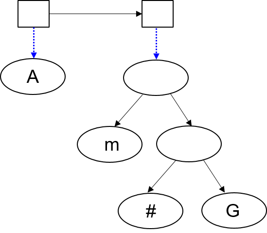
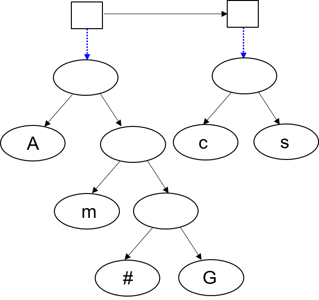
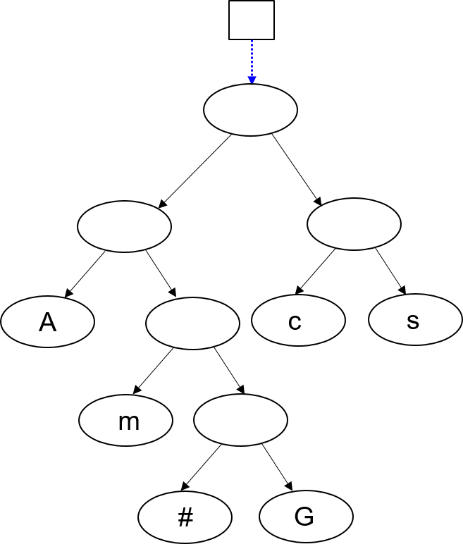

# Build Huffman Code Book from Post-Order Description

Learning Goals
==============

* Understand Huffman Compression

* Understand the description of the compression tree using post-order description

Post-Order Description of Huffman Compress Tree
===============================================

The compression tree can be expressed by post-order traversal.  When a
leaf node is encountered, 1 is printed before printing the characer
stored in the node. When a non-leaf node is encountered, 0 is printed.
If the tree has `n` leaf nodes, the tree has `n-1` non-leaf nodes.
Thus, there are `n` 1 printed (not counting the characters) and `n-1`
0 printed.  A final 0 is added to indicate the end of the description.

To rebuild the compression tree, we need to separate the control
from the data. Consider this example:

Control or Data | C | D | C | D | C | D | C | D  
----------------|---|---|---|---|---|---|---|---
                | 1 | A | 1 | m | 1 | # | 1 | G

When control `1` is seen, the next must be data. Create a tree node to
hold the data and append the node to the end of a list.  The input so
far should proeduce the following list of four tree nodes:

When control `0` is seen, take the latest two tree nodes and make them the left and right child of a new tree
node. Insert this tree node back to the list.

The following input 

Control or Data | C | D | C | D | C | D | C | D | C | C 
----------------|---|---|---|---|---|---|---|---|---|---
                | 1 | A | 1 | m | 1 | # | 1 | G | 0 | 0

will create this result:

The following input 

Control or Data | C | D | C | D | C | D | C | D | C | C | C | C | D | C | D | C
----------------|---|---|---|---|---|---|---|---|---|---|---|---|---|---|---|---
                | 1 | A | 1 | m | 1 | # | 1 | G | 0 | 0 | 0 | 1 | c | 1 | s | 0

will create this result:

The following input 

Control or Data | C | D | C | D | C | D | C | D | C | C | C | C | D | C | D | C | C | C
----------------|---|---|---|---|---|---|---|---|---|---|---|---|---|---|---|---|---|---
                | 1 | A | 1 | m | 1 | # | 1 | G | 0 | 0 | 0 | 1 | c | 1 | s | 0 | 0 | 0

will create this result:

Your Program's Output
=====================

Your program will output the codes of the characters